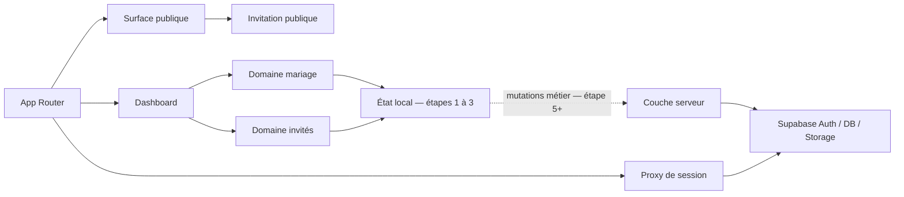
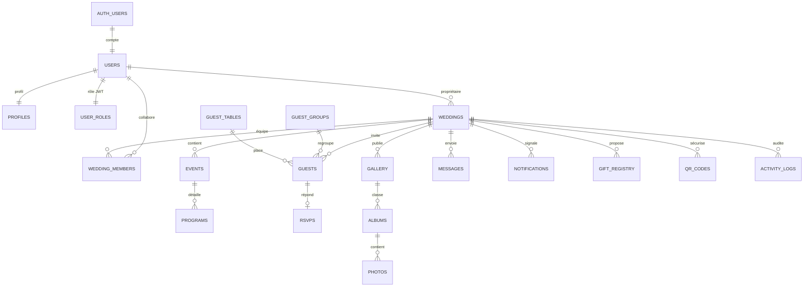

# Architecture NDOA

## État actuel

NDOA utilise Next.js 16 avec l’App Router, React 19, TypeScript strict,
Tailwind CSS 4, Base UI/shadcn, React Hook Form, Zod et Framer Motion.

Les étapes 1 à 4 stabilisent le prototype, sa frontière backend, son
identité :

- les routes publiques et dashboard ont des états explicites ;
- le formulaire mariage est typé et validé par étape ;
- le module invités fonctionne localement ;
- le CSV est borné, correctement encodé et protégé contre les formules ;
- l’invitation résout son slug côté serveur et produit un QR réel ;
- les barrières lint, types, tests, build et E2E sont présentes.
- l’environnement Supabase public est validé avant utilisation ;
- les clients navigateur et serveur sont séparés et typés ;
- le proxy Next.js rafraîchit les sessions avant le rendu ;
- la configuration et les migrations locales sont versionnées.
- les actions d’authentification sont exécutées côté serveur et validées ;
- les routes sensibles appliquent les rôles issus de claims JWT vérifiés.
- les 19 tables métier demandées sont versionnées avec contraintes et index ;
- toutes les tables exposées activent RLS sans policy anonyme ;
- les médias utilisent un bucket privé partitionné par `wedding_id`.

## Frontières de modules

Les composants UI ne doivent pas accéder directement aux futurs clients
Supabase. Les lectures serveur et mutations seront placées derrière des
fonctions de domaine validées par Zod.

## Principes pour Supabase

L’étape 2 établit les éléments suivants avant toute persistance métier :

1. validation typée de l’environnement ;
2. client navigateur avec clé publique uniquement ;
3. client serveur utilisant les cookies de session ;
4. aucune clé `service_role` dans le bundle ou les variables publiques ;
5. types de base versionnés et commande de régénération reproductible ;
6. migrations locales reproductibles.

Le client serveur est créé par requête : aucun singleton global ne peut
partager une session entre deux exécutions Vercel. Le proxy appelle
`auth.getClaims()` avant le rendu, réécrit les cookies rafraîchis et transmet
les en-têtes `private, no-store` fournis par `@supabase/ssr`. Une absence
complète de configuration conserve temporairement le prototype local ; une
configuration partielle échoue.

## Authentification et rôles

Les rôles applicatifs sont `admin`, `organizer` et `guest`.

- `user_role` est lu depuis le JWT vérifié par `auth.getClaims()` ;
- un rôle de repli `organizer` est attribué aux comptes standards confirmés ;
- `app_metadata.user_role` est accepté car l’utilisateur ne peut pas le
  modifier lui-même ;
- `user_metadata.role` n’est jamais utilisé pour autoriser une action ;
- `/admin`, `/dashboard` et `/guest` possèdent des listes de rôles distinctes ;
- une destination `next` externe ou contenant une barre oblique inverse est
  rejetée.

L’étape 4 créera la table de rôles, le Custom Access Token Hook qui émet
`user_role` et les politiques RLS. L’interface ne remplace jamais ces contrôles
de base de données.

L’étape 4 rend l’isolation multi-tenant structurelle :

- `weddings` possède un propriétaire immuable ;
- `wedding_members` porte les collaborations et rôles locaux ;
- chaque table métier référence le mariage ;
- RLS est activée sur toutes les tables et tous les buckets exposés ;
- les tests doivent prouver qu’un utilisateur du mariage A ne peut ni lire ni
  modifier les données du mariage B.

Les clés composites `(id, wedding_id)` empêchent de rattacher un invité, un
album, une photo, un RSVP ou un message à un objet appartenant à un autre
mariage. Les fonctions `security definer` utilisées par RLS vivent dans le
schéma non exposé `private` avec un `search_path` vide.

## Frontière publique

Une invitation publiée ne doit exposer qu’une projection limitée : noms
affichés, date, programme, lieu, thème et médias publiés. Les coordonnées des
invités, réponses RSVP privées, identifiants internes et journaux ne doivent
jamais apparaître dans cette projection.

Les réponses RSVP et le check-in utiliseront des codes non devinables,
validation serveur, limitation de débit et opérations idempotentes.

## Conventions

## Couche API (étape 5)

Les mutations métier passent par les routes `app/api` et non par les clients
Supabase dans les composants UI. `requireApiContext` impose une configuration
Supabase complète et une session vérifiée avant toute requête. Les payloads
camelCase sont validés par Zod puis sérialisés vers le contrat SQL
snake_case ; les listes utilisent des paramètres de pagination et de tri sur
liste blanche. L’enveloppe `{ data, requestId }` et les codes d’erreur stables
facilitent l’observabilité sans divulguer les détails Postgres.

- Server Components par défaut ; `"use client"` uniquement pour
  l’interactivité.
- Zod aux frontières de confiance.
- TypeScript strict, aucun `any` évitable.
- Les mutations vérifient l’identité, l’autorisation puis valident les données,
  dans cet ordre.
- Les listes utilisent des tris et filtres sur listes blanches.
- Les erreurs utilisateur sont stables et les détails techniques restent dans
  les logs serveur.
- Chaque étape dispose d’une branche dédiée et de commits atomiques.
